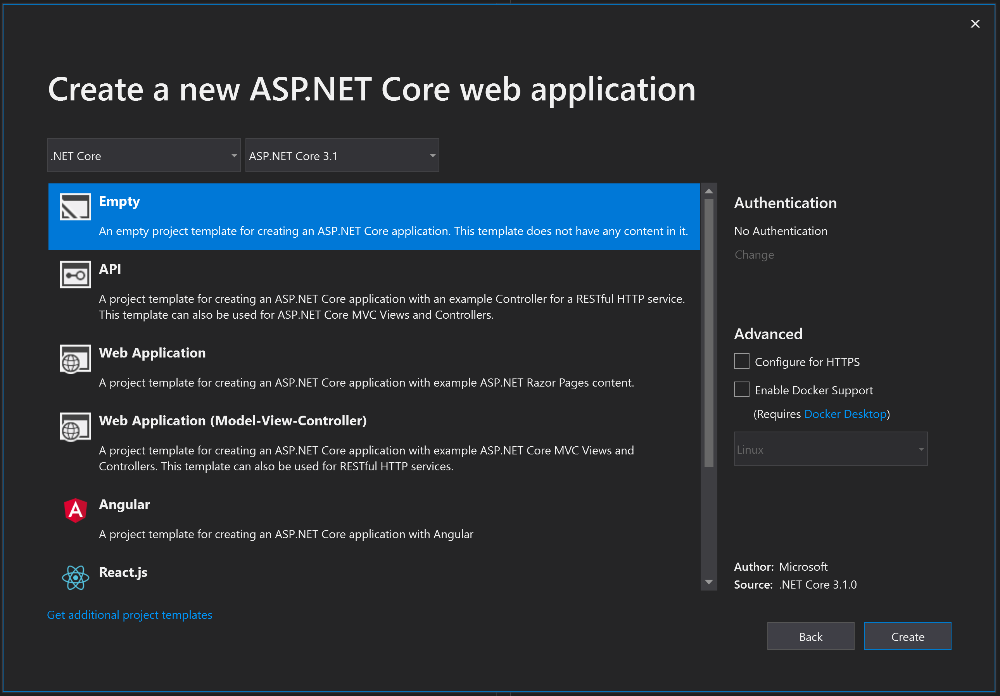
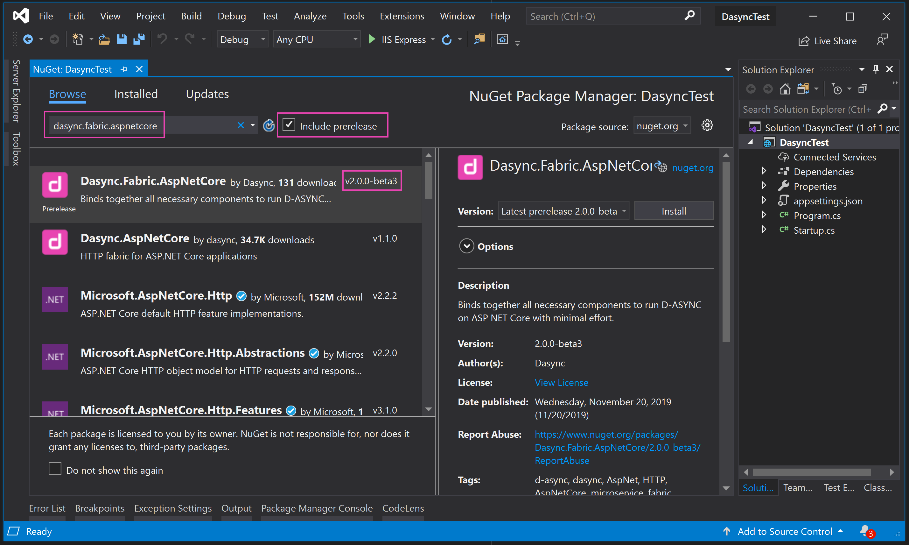
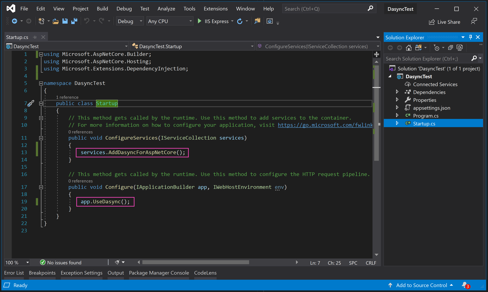
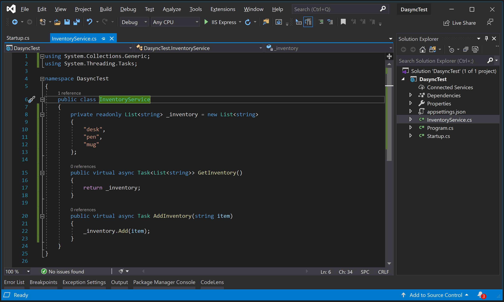
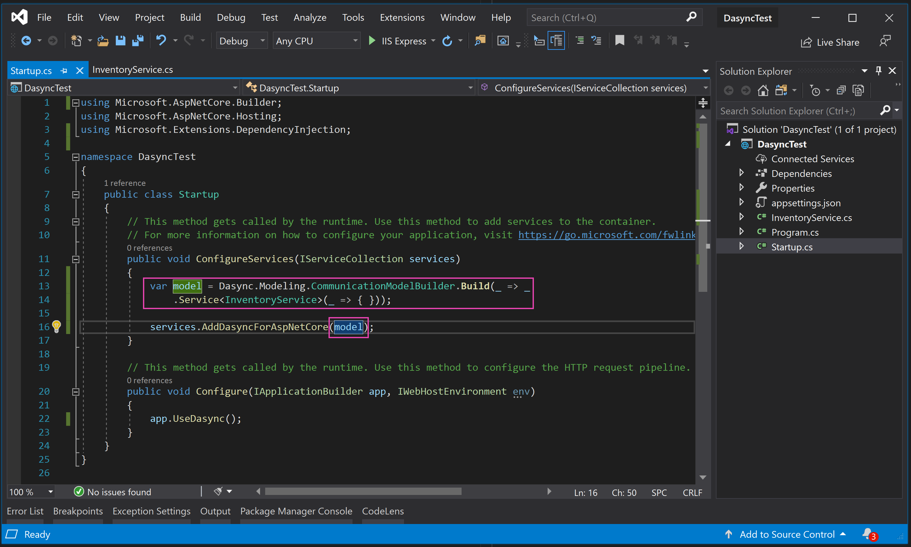
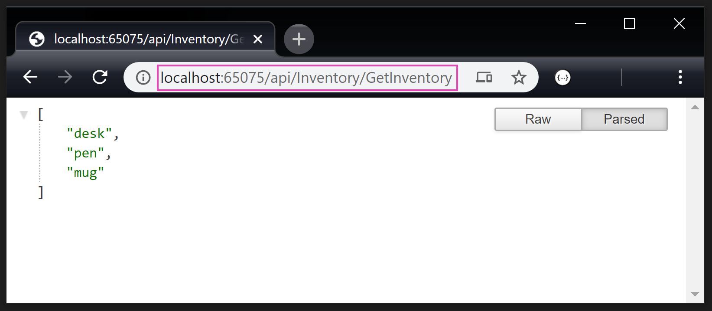
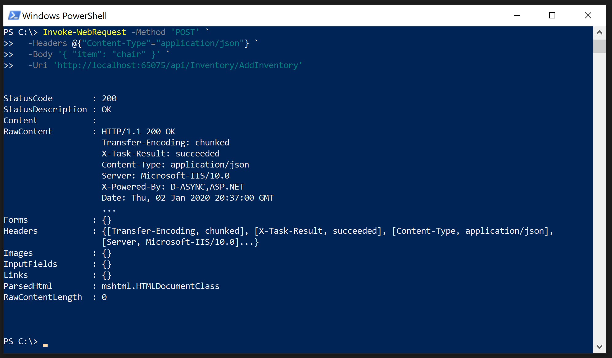

# Tutorial 1: Create First Service
This short tutorial demonstrates how to create your first D-ASYNC service hosted with ASP NET Core and how to use synchronous HTTP communication.

## 1. Create New Asp Net Core Project


Using Visual Studio (or the method of your preference), create new empty ASP NET Core application.

## 2. Add D-ASYNC NuGet Packages


Using Visual Studio NuGet Package Manager, add a reference to the [Dasync.Fabric.AspNetCore](https://www.nuget.org/packages/Dasync.Fabric.AspNetCore) package.
> NOTE: make sure to check the "Include prerelease" option, as the D-ASYNC version 2 is in beta at the moment of writing this tutorial.

You can also use the Visual Studio's [Package Manager Console](https://docs.microsoft.com/en-us/nuget/consume-packages/install-use-packages-powershell):
```powershell
Install-Package Dasync.Fabric.AspNetCore -ProjectName DasyncTest
```

Or the [NET Core CLI](https://docs.microsoft.com/en-us/dotnet/core/tools/?tabs=netcore2x):
```
dotnet add package Dasync.Fabric.AspNetCore
```

## 3. Configure Startup


Modify the `Startup.cs` to include D-ASYNC runtime:
```csharp
public void ConfigureServices(IServiceCollection services)
{
    services.AddDasyncForAspNetCore(model);
}
```
And to use the HTTP handler:
```csharp
public void Configure(IApplicationBuilder app, IWebHostEnvironment env)
{
    app.UseDasync();
}
```

## 4. Create Sample Service


Add a new `InventoryService.cs` file to the project and implement the class as follows:
```csharp
public class InventoryService
{
    private readonly List<string> _inventory = new List<string>
    {
        "desk",
        "pen",
        "mug"
    };

    // A query.
    public virtual async Task<List<string>> GetInventory()
    {
        return _inventory;
    }

    // A command.
    public virtual async Task AddInventory(string item)
    {
        _inventory.Add(item);
    }
}
```

## 5. Define Communication Model


The added `InventoryService` class needs to be declared as a D-ASYNC service using a Communication Model. The model allows you to fine tune a service declaration, however, that topic is not covered in this tutorial.

Go back to the `Startup.cs` and amend the `ConfigureServices` method:
```csharp
var model = Dasync.Modeling.CommunicationModelBuilder.Build(_ => _
    .Service<InventoryService>(_ => { }));

services.AddDasyncForAspNetCore(model);
```

## 6. Execute Queries


The project is ready to run, start the application (hit F5 in Visual Studio). By default it opens a browser window with no response from the service.

Modify the URL to invoke the query method by adding `/api/Inventory/GetInventory`, where `/api` is the default API path, `/Inventory` or `/InventoryService` is the service name, and `GetInventory` is the method name.

Alternatively, you can use PowerShell:
```powershell
# PowerShell
# NOTE: set the right port number
 Invoke-WebRequest http://localhost:65075/api/Inventory/GetInventory
```
Or curl:
```bash
# bash
# NOTE: set the right port number
curl http://localhost:65075/api/Inventory/GetInventory
```
Or a GUI tool like [Postman](https://www.getpostman.com/).

## 7. Execute Commands


Executing commands is similar to executing queries, except using the POST method instead of GET. Method names in the URL and input argument names in the request body must match the code. 

With PowerShell:
```powershell
# PowerShell
# NOTE: set the right port number
Invoke-WebRequest -Method 'POST' `
    -Headers @{"Content-Type"="application/json"} `
    -Body '{ "item": "chair" }' `
    -Uri 'http://localhost:65075/api/Inventory/AddInventory'
```

With curl:
```powershell
# bash
# NOTE: set the right port number
curl -v --request POST \
  --header "Content-Type: application/json" \
  --data '{ "item": "chair" }' \
  http://localhost:65075/api/Inventory/AddInventory
```

You can also use a GUI tool like [Postman](https://www.getpostman.com/).

## Keep Going
* Tutorial 2: Inter-Service Communication
* Tutorial 3: Events and Pub-Sub
* Tutorial 4: Use Asyncrhonous Messages