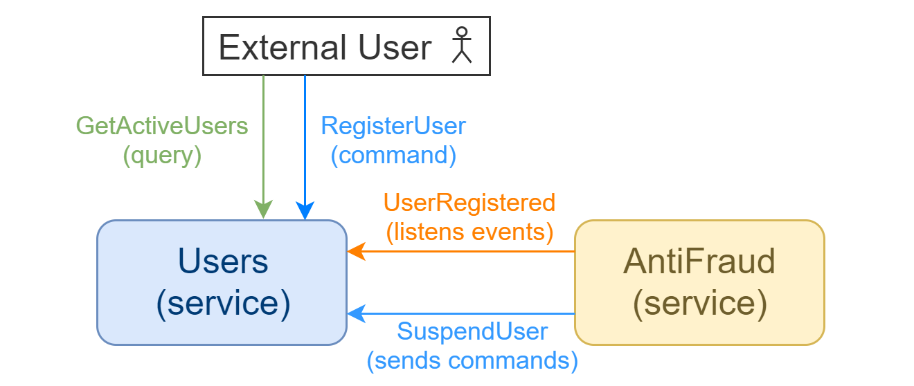
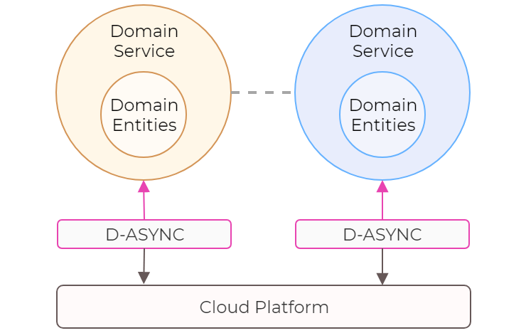
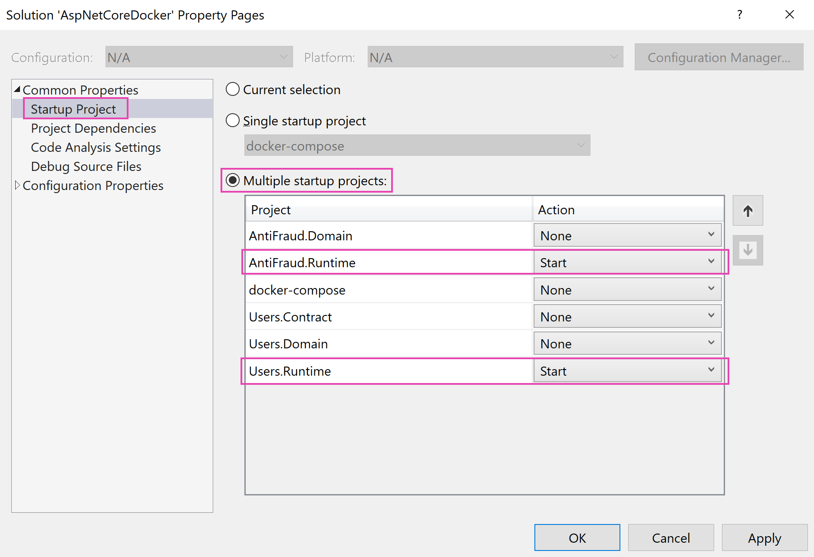

## Description

This demo shows two services - `Users` and `AntiFraud`, their internal interaction via commands and events, and external interaction via queries and commands.

The `Users` service can register a new user (command), suspend a user (make inactive; command), get a list of all active users (query), and notify whenever a new user is registered (event). The `AntiFraud` service reacts to the event of registering a new user, and using a _sophisticated ML algorithm_ decides if a user is a potential fraud. When positive, the `AntiFraud` service tells the `Users` service to suspend a user.



## Technical Scope

The demo shows D-ASYNC's core concept of Clean Code where non-functional aspects of service communication don't get intermixed with the business logic regardless if the API is asynchronous or not, if the execution guarantee is at-least-once or at-most-once, if intermediate context of a workflow needs to be persisted or not.

In the code you can find the basic use of communication primitives (queries, commands, and events) within services. With prepared two sets of example configuration, the multi-service application can use various inter-service communication mechanisms (HTTP and message queues) for the same API surface and for the same code that represents business logic.

The structure of the solution is based on the Onion Architecture (Hexagonal Architecture, "Ports and Adapters") where the `*.Contract.csproj` projects define the surface area of service APIs, the `*.Domain.csproj` include the core domain business logic of services, and `*.Runtime.csproj` contain all non-functional infrastructural aspects.



## Launch Options

### 1. Docker Compose
Select `docker-compose.dcproj` as the startup target. This option will start the two services, a [RabbitMQ](https://www.rabbitmq.com) message broker, and a [Cassandra](https://cassandra.apache.org) NoSQL database. 

The `Users.Runtime` and `AntiFraud.Runtime` projects will use their `appsettings.Development.json` configuration file, which tells the D-ASYNC engine to use RabbitMQ message queues for both commands and queries, and RabbitMQ exchanges for events for service inter-communication. You can still hit HTTP  endpoints externally. Cassandra database is used to store methods' execution state and their results for asynchronous HTTP calls (result polling).

Using message queues for queries is not effective. To use HTTP for queries only you can override settings in `appsettings.Development.json` like this:
```json
  "dasync": {
    "queries": {
      "communication": {
        "type": "http"
      }
    }
  }
```
So that commands and events will still be using RabbitMQ. Although, there is no inter-service querying example is shown in the code.

### 2. IIS Express
In some cases, it is easier to launch light-weight service instances hosted locally in IIS Express when no other containers are needed rather than services themselves. Go to properties of the `AspNetCoreDocker` solution, then the `Startup Project` tab, and select the `Multiple startup projects` option. Then set `Action` to `Start` for the `Users.Runtime` and `AntiFraud.Runtime` projects.



With this option, the `appsettings.IISExpress.json` configuration file is used, which tells the D-ASYNC engine to use HTTP-only inter-service communication. This includes queries, commands, and events. However, events over HTTP are available in a development environment only and must not be used in a production or other non-development environments.

The downside of this light-weight option is the need for configuring ports for every service since there is no service discovery mechanism is used.

## Testing API
The HTTP-based endpoints have a simple convention for executing commands and queries.

### Queries
To run a service query, do `HTTP GET` to:
`http[s]://{host}:{port}/api/{service-name}/{method-name}?{arg1}={value1}&{arg2}={value2}`

For example, a query method in the `Users` service is defined in code like this:
```csharp
public interface IUsersService
{
    Task<List<User>> GetActiveUsers(int? top = null);
}
```
To invoke it, do `HTTP GET` to `http://localhost:52979/api/Users/GetActiveUsers?top=10`.

```bash
# bash
curl http://localhost:52979/api/Users/GetActiveUsers?top=10
```
```powershell
# PowerShell
Invoke-WebRequest  http://localhost:52979/api/Users/GetActiveUsers?top=10
```

### Commands
To invoke a service command, do `HTTP POST` to:
`http[s]://{host}:{port}/api/{service-name}/{method-name}`
with `application/json` body representing method's arguments:
`{ "arg1": value1, "arg2": value2 }`

For example, a command method in the `Users` service is defined in code like this:
```csharp
public interface IUsersService
{
    Task RegisterUser(string name, string email);
}
```
To invoke it, do `HTTP POST` to `http://localhost:52979/api/Users/RegisterUser` with the `Content-Type` header set to `application/json` and the body `{ "name": "test", "email": "test@dasync.io" }`.

```bash
# bash
curl -v --request POST \
  --header "Content-Type: application/json" \
  --data '{ "name": "test", "email": "test@dasync.io" }' \
  http://localhost:52979/api/Users/RegisterUser
```
```powershell
# PowerShell
Invoke-WebRequest -Method 'POST' `
  -Headers @{"Content-Type"="application/json"} `
  -Body '{ "name": "test", "email": "test@dasync.io" }' `
  -Uri 'http://localhost:52979/api/Users/RegisterUser'

```

### Asynchronous Commands
To invoke a command asynchronously, add the `Prefer` HTTP header with the value of `respond-async` to the request (see [RFC7240](https://tools.ietf.org/html/rfc7240)). The response is HTTP 202 Accepted and the `X-Intent-ID` contains a unique execution ID that is used for polling as shown below. To perform a long poll, add e.g. `Prefer: wait=20` to the poll GET request

```bash
# bash
curl -v --request POST \
  --header "Prefer: respond-async" \
  --header "Content-Type: application/json" \
  --data '{ "name": "test", "email": "test@dasync.io" }' \
  http://localhost:52979/api/Users/RegisterUser

curl http://localhost:52979/api/Users/RegisterUser/${X-Intent-ID}
```
```powershell
# PowerShell
$response = Invoke-WebRequest -Method 'POST' `
  -Headers @{"Prefer"="respond-async";"Content-Type"="application/json"} `
  -Body '{ "name": "test", "email": "test@dasync.io" }' `
  -Uri 'http://localhost:52979/api/Users/RegisterUser'
$intentId = $response.Headers['X-Intent-ID']
Invoke-WebRequest "http://localhost:52979/api/Users/RegisterUser/$intentId"
```